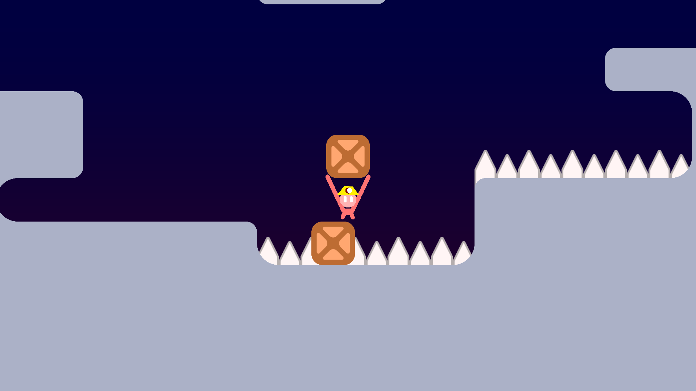
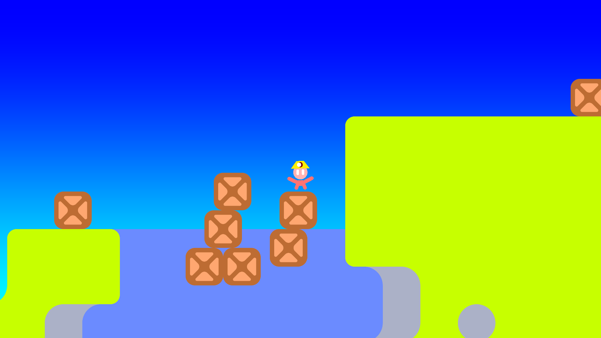
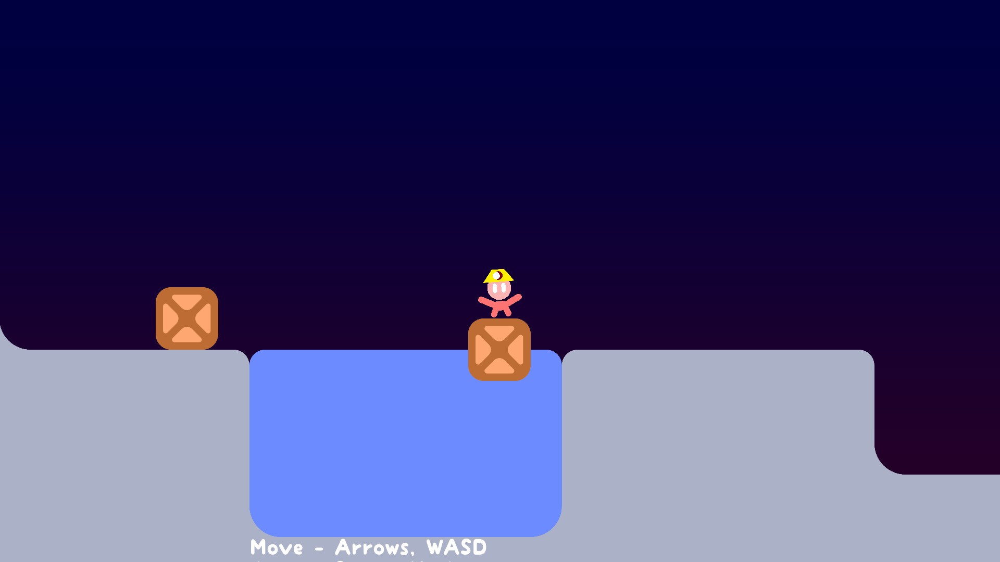
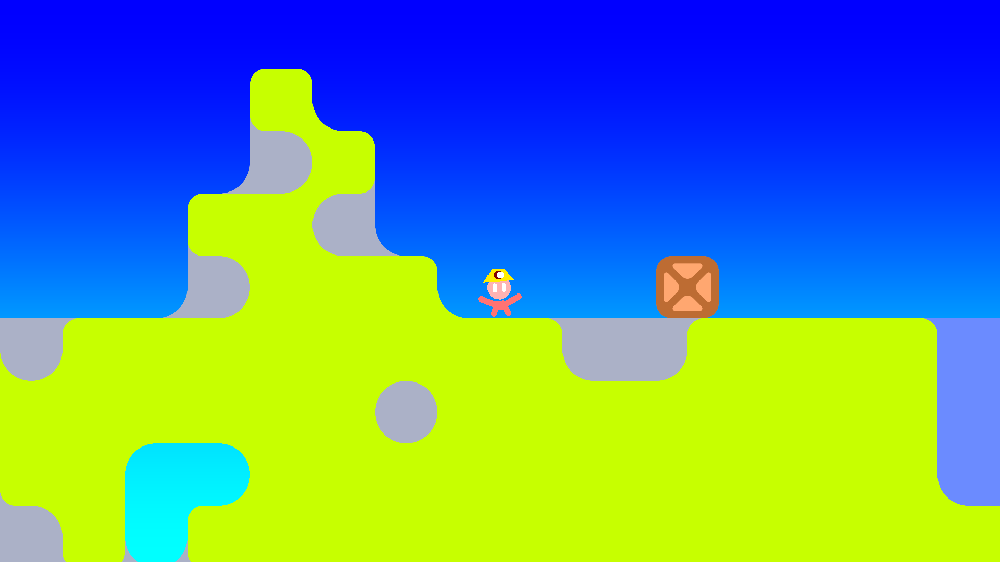
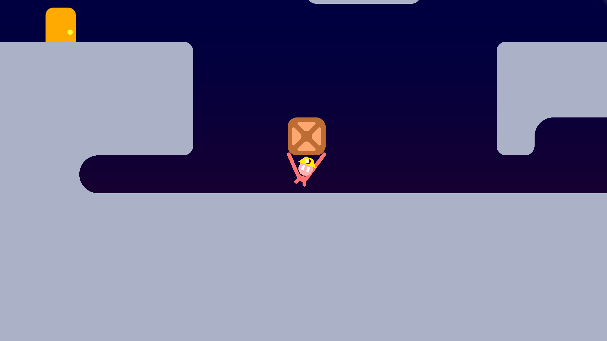

#  Tiny Crate 2 Prototype
Made with [Godot Engine 3.5.2](https://godotengine.org/)

Crate Chucking Puzzle Platformer Prototype

Play now on [itch.io](https://harmonyhoney.itch.io/tinycrate2) ! (:

## License
See [UNLICENSE](UNLICENSE) or [Unlicense.org](https://unlicense.org/) for more information.

## Screenshots

